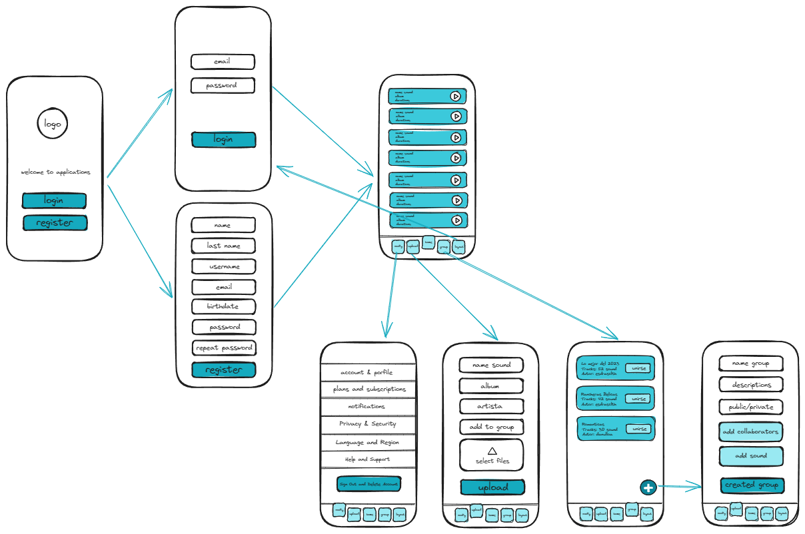

# Echow Projects App

Echow es una aplicación móvil desarrollada en Android Studio que tiene como objetivo automatizar la gestión de archivos mp3 y mp4 en dispositivos móviles, permitiendo reproducirlos y compartirlos entre usuarios. Echow brinda una experiencia fluida y conveniente, facilitando el acceso a la música almacenada en dispositivos móviles para su disfrute y difusión entre amigos, familiares y el mundo en general.

## Características principales

- **Pantalla de Login de usuario:** La aplicación cuenta con una pantalla de inicio de sesión que permite a los usuarios registrarse en la aplicación. Se enviará un código de verificación al correo electrónico proporcionado y se almacenarán de forma segura los datos ingresados.
  
- **Recuperación de clave:** En caso de extravío de la clave, los usuarios tienen la opción de solicitar el reenvío de la clave temporal al correo electrónico registrado.

- **Creación de grupos:** Los usuarios tienen la capacidad de crear grupos dentro de la aplicación, lo que les permite compartir archivos de audio y video con otros miembros del grupo.

- **Subir audios:** Echow permite a los usuarios subir archivos mp3 y mp4, ya sea para uso personal o para compartirlos en un grupo de usuarios de la aplicación.

- **Perfil del usuario:** Cada usuario puede crear un perfil personalizado que incluye una foto y una descripción.

- **Reproducción de archivos:** Los usuarios pueden seleccionar y reproducir archivos de audio desde la aplicación.

- **Notificaciones push:** La aplicación envía notificaciones push para informar a los usuarios cuando se ha subido un nuevo archivo de audio o música a un grupo al que pertenecen.

## Instrucciones de instalación

Para utilizar Echow, sigue estos pasos:

1. Descarga el archivo APK de la última versión de la aplicación desde la sección de "Releases" en GitHub.
2. Instala el archivo APK en tu dispositivo Android.
3. Abre la aplicación e inicia sesión con tus credenciales o regístrate si eres un nuevo usuario.
4. Explora las diferentes características de la aplicación y disfruta de la gestión automatizada de archivos de audio y video.

## Contribuciones

¡Las contribuciones son bienvenidas! Si deseas contribuir a Echow, sigue estos pasos:

1. Realiza un fork del repositorio.
2. Crea una nueva rama (`git checkout -b feature/feature-name`).
3. Realiza tus cambios y haz commits (`git commit -am 'Add new feature'`).
4. Sube tus cambios a tu fork (`git push origin feature/feature-name`).
5. Realiza un pull request a la rama principal del repositorio original.

## Problemas y sugerencias

Si encuentras algún problema o tienes alguna sugerencia para mejorar Echow, por favor, abre un nuevo issue en el repositorio de GitHub.

## Desarrolladores

- Esdras Abiel Clother Paz (202010010048)
- Eber Orestes González Garcia (201810030032)
- Bayardo Antonio Ponce Ruiz (202110110125)
- Dennis Antonio Landero Ramos (201910070086)
- Jafeth Donatilo Rápalo Rivera (202120030040)
- Delcer Oviel Hernandez (201510050050)
- Elvis José Riera (201210010484)

## Licencia

Echow es libre, gratuito y de codigo abierto.

---

*Este proyecto a sido desarrollado con fines educativos por alumnos de la [Universidad Tegnologica de Honduras](https://www.uth.hn)*
